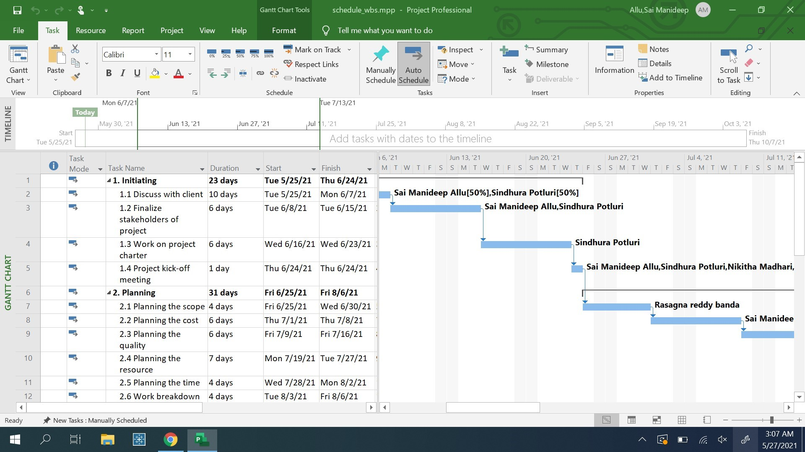
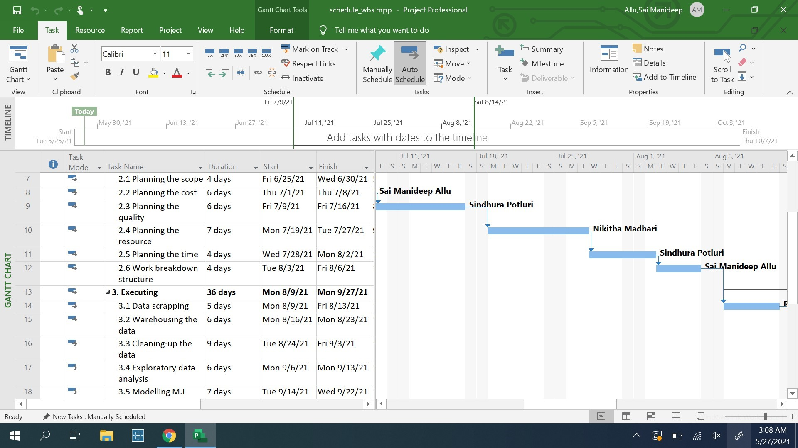
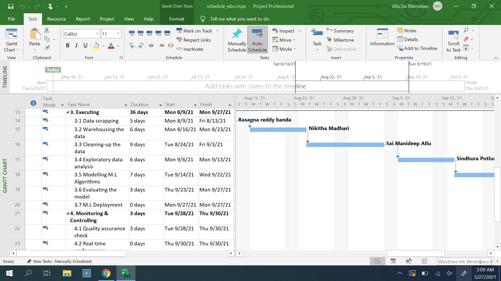
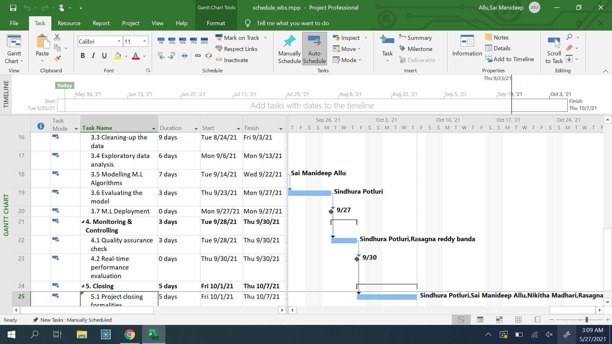
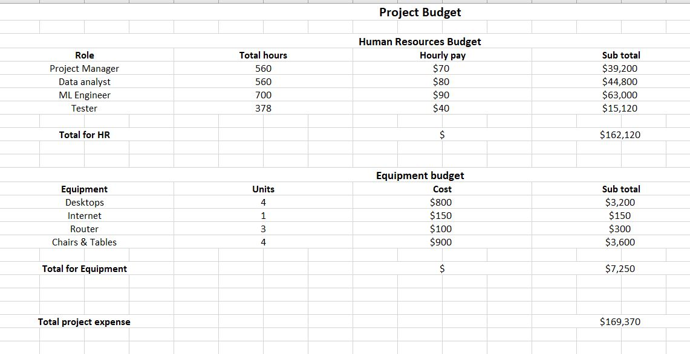

# pm-s03-g04-project

## Table of contents
*  Our Project
*  Our Team
*  Project Charter
*  Scope
*  Schedule
*  Budget

## Our Project
*  Analyzing the company data to improve sales
*  It was a project to gather the data and utilize it effectively to get the insights out of it.

## Our Team
*  Sai Manideep Allu

*  Sindhura Potluri

*  Rasagna Reddy Banda

*  Narsing Rao Nikitha Madhari

## [project Charter](https://github.com/saimanideepallu/pm-s03-g04-project/blob/main/charter.md)

## Scope
### Work Breakdown Structure
#### 1. Intiating
<ul>
<li>1.1 Discuss with client</li>
<li>1.2 Finalize stakeholders of project</li>
<li>1.3 Work on project charter</li>
<li>1.4 Project kick-off meeting</li>
</ul>

#### 2. Planning
<ul>
<li>2.1 Planning the scope</li>
<li>2.2 Planning the cost</li>
<li>2.3 Planning the quality</li>
<li>2.4 Planning the resource</li>
<li>2.5 Planning the time</li>
<li>2.6 Work breakdown structure</li>
</ul>

#### 3. Executing
<ul>
<li>3.1 Data scrapping</li>
<li>3.2 Warehousing the data</li>
<li>3.3 Cleaning-up the data</li>
<li>3.4 Exploratory data analysis/li>
<li>3.5 Modelling M.L Algorithms</li>
<li>3.6 Evaluating the model</li>
<li>3.7 M.L Deployment</li>
</ul>

#### 4. Monitoring & Controlling
<ul>
<li>4.1 Quality assurance check</li>
<li>4.2 Real-time performance evaluation</li>
</ul>

#### 5. Closing
<ul>
<li>5.1 Project closing formalities</li>
</ul>

## Schedule
<ul>
  <li>Start date</li>
  <ul>
    <li>5/25/21</li>
  </ul>  
  <li>End date</li>
  <ul>
    <li>10/4/21</li>
  </ul>  
  <li>Duration</li>
  <ul>
    <li>98 days/14 weeks</li>
  </ul>  
</ul>

## Budget

