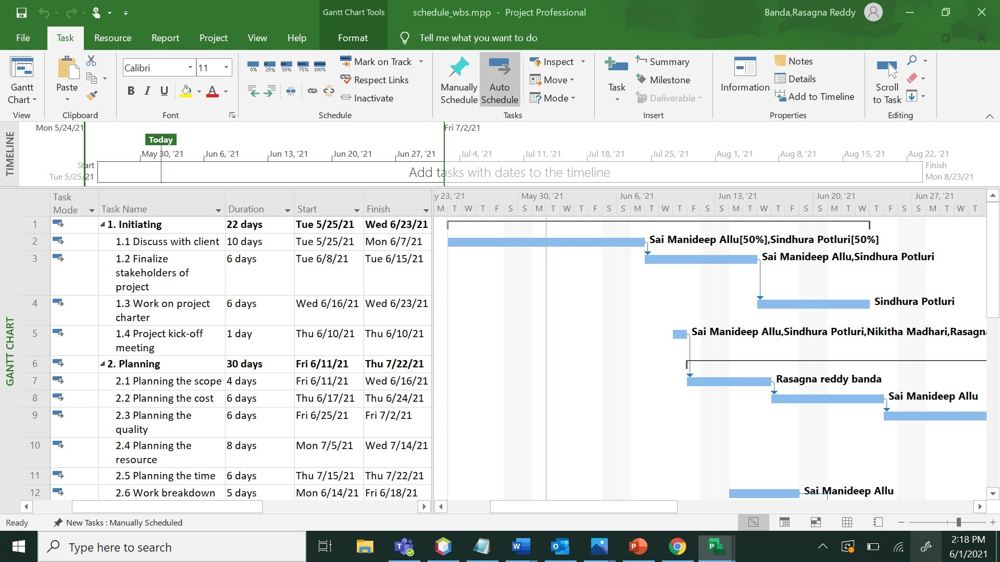
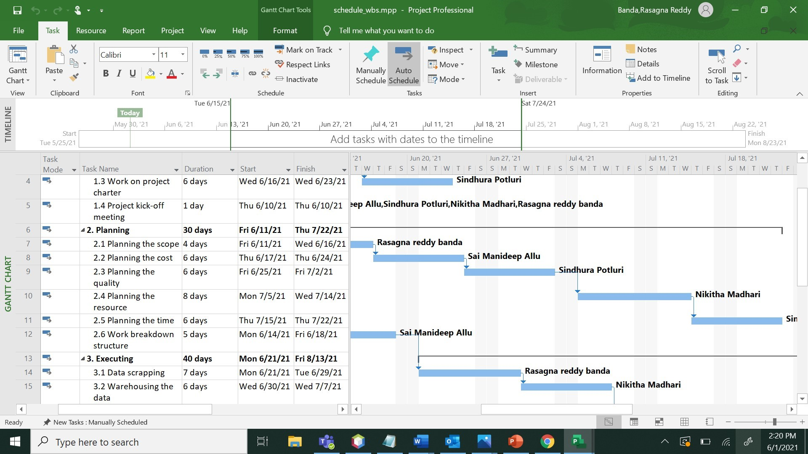
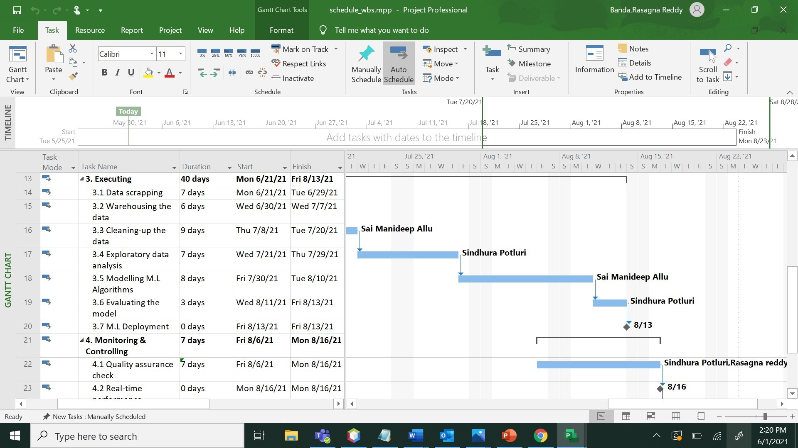
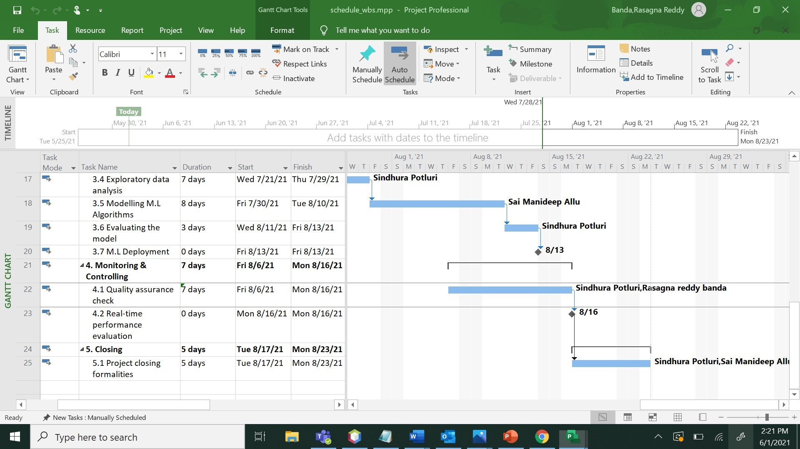

# Insurance company data analysis

## Table of contents
*  Our Project
*  Our Team
*  Project Charter
*  Scope
*  Schedule
*  Budget
*  References

## Our Project
*  Analyzing the insurance company data to improve insurance policy sales.
*  An private insurance company was suffering from losses, So by using the historical data that company has been maintaining with it and also by using external data we has been analyzed the data and suggested the company to improve its insurance policy sales.

## Our Team
*  [Sai Manideep Allu](https://github.com/saimanideepallu)

*  [Sindhura Potluri](https://github.com/sindhurapotluri)

*  [Rasagna Reddy Banda](https://github.com/Rasagna0409)

*  [Narsing Rao Nikitha Madhari](https://github.com/NikithaMN-05)

#### [Project Charter](https://github.com/saimanideepallu/pm-s03-g04-project/blob/main/charter.md)

## Scope
### Work Breakdown Structure
#### 1. Intiating
<ul>
<li>1.1 Discuss with client</li>
<li>1.2 Finalize stakeholders of project</li>
<li>1.3 Work on project charter</li>
<li>1.4 Project kick-off meeting</li>
</ul>

#### 2. Planning
<ul>
<li>2.1 Planning the scope</li>
<li>2.2 Planning the cost</li>
<li>2.3 Planning the quality</li>
<li>2.4 Planning the resource</li>
<li>2.5 Planning the time</li>
<li>2.6 Work breakdown structure</li>
</ul>

#### 3. Executing
<ul>
<li>3.1 Data scrapping</li>
<li>3.2 Warehousing the data</li>
<li>3.3 Cleaning-up the data</li>
<li>3.4 Exploratory data analysis/li>
<li>3.5 Modelling M.L Algorithms</li>
<li>3.6 Evaluating the model</li>
<li>3.7 M.L Deployment</li>
</ul>

#### 4. Monitoring & Controlling
<ul>
<li>4.1 Quality assurance check</li>
<li>4.2 Real-time performance evaluation</li>
</ul>

#### 5. Closing
<ul>
<li>5.1 Project closing formalities</li>
</ul>

#### [View Scope](https://github.com/saimanideepallu/pm-s03-g04-project/blob/main/scope/wbs.mpp)

## Schedule
<ul>
  <li>Start date</li>
  <ul>
    <li>5/25/21</li>
  </ul>  
  <li>End date</li>
  <ul>
    <li>8/23/21</li>
  </ul>  
  <li>Duration</li>
  <ul>
    <li>98 days/14 weeks</li>
  </ul>  
</ul>

#### [View Schedule](https://github.com/saimanideepallu/pm-s03-g04-project/blob/main/schedule/schedule_wbs.mpp)

## Budget
*  The total budget cost has been estimated as $1,80,000 but the total expenses for this project is $1,69,370. So, now by working on this project we are with profit of $10,630.

#### [View Budget](https://github.com/saimanideepallu/pm-s03-g04-project/blob/main/budget/ProjectBudget.xlsx)

## References
1.  [https://www.smartsheet.com/blog/project-charter-templates-and-guidelines-every-business-need](https://www.smartsheet.com/blog/project-charter-templates-and-guidelines-every-business-need)
2.  [https://www.projectmanager.com/project-scheduling](https://www.projectmanager.com/project-scheduling)
3.  [https://www.projectmanager.com/training/create-and-manage-project-budget](https://www.projectmanager.com/training/create-and-manage-project-budget)
4.  [https://github.com/Patrick-David/Insurance-Data-Analysis](https://github.com/Patrick-David/Insurance-Data-Analysis)
